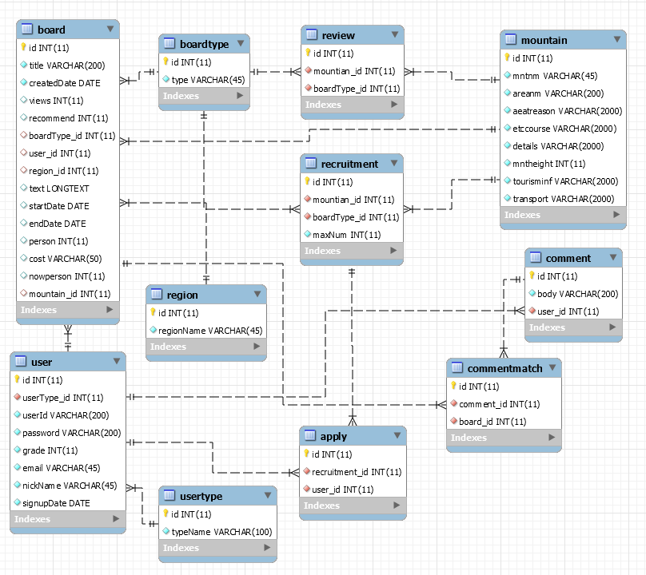
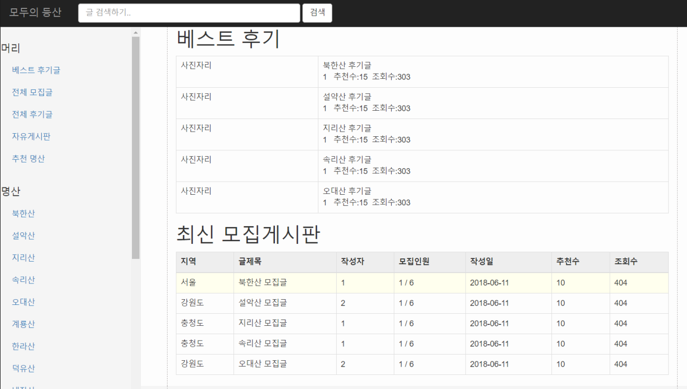
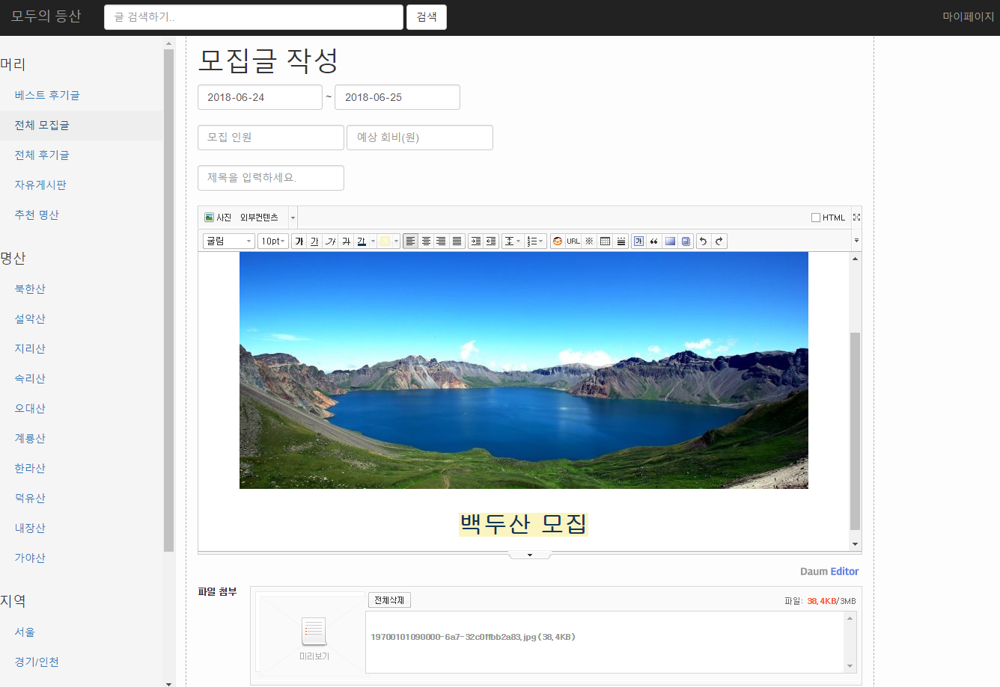

등산 모집 시스템
=============
**등산 인원을 쉽게 모집 할 수 있는 웹 어플리케이션**
1. 지역, 산 별로 게시판 을 통해 등산 인원 모집글을 작성 할 수 있다.
2. 사용자는 모집글을 확인하고 마음에 드는 모임에 신청을 할 수 있다.
3. 마이페이지를 통해 자신의 모임,신청내역 관리가 가능하다.
4. 후기글을 작성 하며, 추천을 많이받은 경우 베스트 후기게시판에서 글을 볼 수 있다.
-------------

### DB Sturcture
   

### 홈 화면
   

### 모집글 작성 화면
   

### POM.XML
```
<?xml version="1.0" encoding="UTF-8"?>
<project xmlns="http://maven.apache.org/POM/4.0.0"
	xmlns:xsi="http://www.w3.org/2001/XMLSchema-instance"
	xsi:schemaLocation="http://maven.apache.org/POM/4.0.0 http://maven.apache.org/xsd/maven-4.0.0.xsd">
	<modelVersion>4.0.0</modelVersion>

	<groupId>net.skhu</groupId>
	<artifactId>climbingTest</artifactId>
	<version>0.0.1-SNAPSHOT</version>
	<packaging>war</packaging>

	<name>climbingTest</name>
	<description>climbing member recriutment System</description>

	<parent>
		<groupId>org.springframework.boot</groupId>
		<artifactId>spring-boot-starter-parent</artifactId>
		<version>2.0.2.RELEASE</version>
		<relativePath /> <!-- lookup parent from repository -->
	</parent>

	<properties>
		<project.build.sourceEncoding>UTF-8</project.build.sourceEncoding>
		<project.reporting.outputEncoding>UTF-8</project.reporting.outputEncoding>
		<java.version>1.8</java.version>
	</properties>

	<dependencies>
		<!-- spring security -->
		<dependency>
			<groupId>org.springframework.boot</groupId>
			<artifactId>spring-boot-starter-security</artifactId>
		</dependency>
		<dependency>
     		 <groupId>org.springframework.security</groupId>
     		 <artifactId>spring-security-taglibs</artifactId>
    	</dependency>
    	
		<dependency>
			<groupId>org.springframework.boot</groupId>
			<artifactId>spring-boot-starter-web</artifactId>
		</dependency>
		<dependency>
			<groupId>org.mybatis.spring.boot</groupId>
			<artifactId>mybatis-spring-boot-starter</artifactId>
			<version>1.3.2</version>
		</dependency>

		<dependency>
			<groupId>mysql</groupId>
			<artifactId>mysql-connector-java</artifactId>
			<scope>runtime</scope>
		</dependency>
		<dependency>
			<groupId>org.springframework.boot</groupId>
			<artifactId>spring-boot-starter-tomcat</artifactId>
			<scope>provided</scope>
		</dependency>
		<dependency>
			<groupId>org.springframework.boot</groupId>
			<artifactId>spring-boot-starter-test</artifactId>
			<scope>test</scope>
		</dependency>

		<dependency>
			<groupId>javax.servlet</groupId>
			<artifactId>jstl</artifactId>
		</dependency>

		<dependency>
			<groupId>commons-fileupload</groupId>
			<artifactId>commons-fileupload</artifactId>
			<version>1.3.1</version>
		</dependency>

		<dependency>
			<groupId>commons-io</groupId>
			<artifactId>commons-io</artifactId>
			<version>2.4</version>
		</dependency>

	</dependencies>

	<build>
		<plugins>
			<plugin>
				<groupId>org.springframework.boot</groupId>
				<artifactId>spring-boot-maven-plugin</artifactId>
			</plugin>
		</plugins>
	</build>

</project>
```
### 사용 기술
> Spring Boot
> Spring Security
> JSP
> AJAX
> MySQL
> MyBatis
> BootStrap   

### Team
소프트웨어공학과  
> 201332012 박준영  
> 201332031 전현우  


